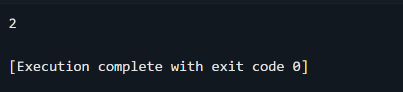

해당 문제는 배추밭의 크기, 배추의 위지 및 좌표가 주어지며, 2차원 배열 지도의 형태로

배추의 정보가 주어짐과 동시에 4방향의 인접연결을 지원합니다.

배추의 개수의 경우, K 변수에 삽입하여 모든 좌표의 입력이 끝난 후, 배추의 위치를

기록하기 위해서 사용하며, 노드 간의 가중치는 존재하지 않지만 인접한 배추를 통해서

연결 그래프를 형성할 수 있고, 모든 배추를 탐색하기 위해서 DFS 알고리즘과 visited 배열을

사용하여 재귀호출을 통해 문제를 풀이하려고 노력하였습니다.

또한 기존에 풀이했던 문제들과 2차원 지도 탐색을 통해서 모든 지점의 연결 상태를 탐색하고,

A[i][j]의 값이 1이고, visited 즉, 방문하지 않았다면 count 변수의 값을 1 증가시켜서

배추흰지렁이의 마리 수를 출력하게 됩니다.

